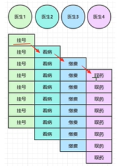

#### netty笔记
+ 反思后，应该用一种更好的方式做笔记，不要东一下西一下

##### 为什么要异步?
+ 我们发现，netty的方法大多都是基于异步处理，比如close()和channel()
+ 异步就是指，方法调用者，和方法执行者 不是同一个线程。
+ 这就导致，执行异步方法时，往往方法调用者线程还在跑。而且最糟糕的情况就是，调用者线程试图去获取一个 执行者线程还没来得及返回的对象
+ 所以我们不得不有时候让主线程停下来，或者注册监听器，监听器可以在方法执行者的线程 返回需要的结果后执行相关回调函数，在回调函数里，我们让主线程获取到异步线程的返回对象。
+ 而netty为什么要这么做呢?

###### 举例
四个医生并行看病。一个病人看20分钟，一个医生一天工作8小时

因此最后一天可以看 60/20*8*4=96个

---

现在经过划分 ==> 看病的20分钟，由5分钟挂号，5分钟看病，5分钟缴费，5分钟拿药。

异步方式

医生1 ==> 挂号

医生2 ==> 看病

医生3 ==> 缴费

医生4 ==> 取药

netty的操作基于CPU的流水线操作。
医生1挂号后，把看病操作交给异步线程医生2处理。同理 ...

但是：病人经过的流程变多了，可能病人挂完号后，走路去看病...，看完病，走路去缴费

这就导致了病人完成一次看病，需要更多的线程切换的开销。



要点：
1) 单线程无法异步提高效率，必须配合多线程，多核CPU才能发挥异步的效果
2) 异步 没有缩短响应时间，反而有所增加 [增加的是吞吐量，即单位时间内来看病的病人总量，单个病人花费的时间反而多了]
3) 合理的把任务进行拆分，单个线程只负责一个操作，下面的操作交给异步线程执行

###### Future & Promise
+ JDK的Future是netty的Future的父类，二者是同名接口，只不过包不同，也就是命名空间不同
+ promise继承自netty的Future

比较
1) JDK的future只能让 调用者线程阻塞等待，同步等待[sync机制] 执行者线程的返回结果
2) netty的future可以使用异步方式 获得结果[listener-callback机制]
3) promise 扩展nettyFuture，可以脱离任务独立存在，只作为两个线程传递结果的容器。

举例
注意：无论是future还是promise。都是存储执行结果的容器对象
而真正执行任务的是线程对象。future/promise用于存放线程对象处理结果
1) JDK的future：老板让员工给他买烟。老板烟瘾犯了，烟买不回来就无法工作 [老板同步阻塞，等待员工买烟结果]
2) netty的future：老板需要一支钢笔，于是让员工去买钢笔，在此期间，老板不做任何关于钢笔的工作[因为这时候钢笔还没买来呢],员工一旦买完钢笔，立马通知老板，并把钢笔送到老板手里，这时候老板才做关于钢笔的工作。[也就是说，老板不用傻等着，可以先干一些 不需要异步线程返回结果的工作]
3) promise: 老板和客户，老板需要客户的文件，客户需要老板的合同，于是客户让 快递小哥把文件送到了 快递柜，老板也让快递小哥把合同送到了快递柜，老板可以继续做不涉及文件的工作，客户可以继续做不涉及合同的工作，什么时候需要，就去快递柜里取就行

```java
// 相关方法
// jdkFuture

cancel() // 取消任务
isCancel()  // 查看任务是否取消
isDone() // 任务是否完成，无关失败成功
get() // 主线程同步阻塞，等待异步结果

// nettyFuture
getNow() // 非阻塞，如果异步线程 还没执行完任务并返回结果，主线程获取null
sync() // 等待任务结束，不负责获取结果，就是让主线程同步阻塞，不负责结果获取。如果任务失败，抛异常
await() // 就算任务失败，不抛异常，失败了就继续让主线程继续，需要我们使用isSuccess()方法判断有无异常
cause() // 非阻塞方法，有异常就返回，没异常不会傻等着异常发生，而是返回null
addListener() // 注册一个Listener-Callback 监听者处理器。

// promise
setSuccess() // 通知对方任务正常结束
setFailure() // 通知对象任务 异常结束

```

##### handler
pipeline ==> 流水线

handler ==> 流水线上的各道工序

ChannelInBoundHandlerAdapter ==> 入站处理器，主要用于读取客户端数据，写回结果
ChannelOutBoundHandlerAdapter ==> 出站处理器，主要对写回结果加工

```java
// 服务器的启动器初始代码
    public static void main(String[] args) {
        new ServerBootstrap()
                .group(new NioEventLoopGroup())
                .channel(NioServerSocketChannel.class)
                .childHandler(new ChannelInitializer<NioSocketChannel>() {
                    @Override
                    protected void initChannel(NioSocketChannel ch) throws Exception {
                        
                    }
                })
                .bind(1145);
    }
```


+ ServerSocketChannel <--pipeline--> SocketChannel
  + SocketChannel[C->S入站] <-> head <-> h1 <-> h2 <-> h3 <-> h4 <-> h5 <-> h6 <-> tail <-> [S->C出栈]ServerSocketChannel
+ 当serverSocketChannel收到数据 [入站处理器的readChannel()回调函数 监听到读事件]  
  + socketChannel -> 数据 --> head -> h1 -> h2 -> h3 serverSocketChannel
+ 当serverSocketChannel向socketChannel写数据 [出站处理器的write()回调函数 监听到写事件]
  + serverSocketChannel -> tail -> h6 -> h5 -> h4 -> socketChannel