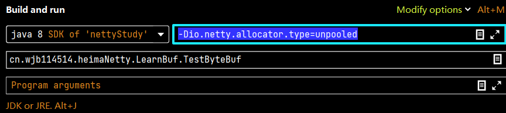

#### embedded channel
```java
@Slf4j
public class TestEmbeddedChannel {
    public static void main(String[] args) {
        // embedded channel 这个netty提供的工具类，可以直接绑定handler。不用再写客户端和服务器端
        ChannelInboundHandler h1 = new ChannelInboundHandlerAdapter() {
            @Override
            public void channelRead(ChannelHandlerContext ctx, Object msg) throws Exception {
                log.debug("1");
                super.channelRead(ctx, msg);
            }
        };
        ChannelInboundHandler h2 = new ChannelInboundHandlerAdapter() {
            @Override
            public void channelRead(ChannelHandlerContext ctx, Object msg) throws Exception {
                log.debug("2");
                super.channelRead(ctx, msg);
            }
        };
        ChannelOutboundHandlerAdapter h3 = new ChannelOutboundHandlerAdapter() {
            @Override
            public void write(ChannelHandlerContext ctx, Object msg, ChannelPromise promise) throws Exception {
                log.debug("3");
                super.write(ctx, msg, promise);
            }
        };
        ChannelOutboundHandlerAdapter h4 = new ChannelOutboundHandlerAdapter() {
            @Override
            public void write(ChannelHandlerContext ctx, Object msg, ChannelPromise promise) throws Exception {
                log.debug("4");
                super.write(ctx, msg, promise);
            }
        };

        EmbeddedChannel channel = new EmbeddedChannel(h1, h2, h3, h4);
        // 其中，Client的一侧是head handler，而Server一侧是tail handler
        // channel.writeInbound(ByteBufAllocator.DEFAULT.buffer().writeBytes("hello,world".getBytes(StandardCharsets.UTF_8))) ; // InBound是指 Client->Server 的数据流动 1 - 2
        channel.writeOutbound(ByteBufAllocator.DEFAULT.buffer().writeBytes("hello,world".getBytes(StandardCharsets.UTF_8))) ; // OutBound是指 Server->Client 的数据流动 4 - 3
    }
}
```

#### ByteBuf

+ 支持两种内存分配，即heap内存和直接内存[mmap] 分配效率和读写效率问题。heap的分配效率高于读写效率， 直接内存读写效率高，分配效率低
+ 直接内存不受到gc影响。

```java
ByteBufAllocator.DEFAULT.buffer() ==> 默认获取直接内存的buffer。
ByteBufAllocator.DEFAULT.heapBuffer() ==> 手动获取堆内存的buffer。
```

+ ByteBuf底层采取 池化。池化的好处是可以重用ByteBuf
  + 因为底层采取直接内存，如果用完就释放，开销很大。就算采取堆内存，也会导致GC压力
  + 可以重用ByteBuf，而且采取了与jemalloc类似的内存分配算法，提高了分配效率
  + 高并发时，可以避免OOM的发生。
  + 系统变量 -Dio.netty.allocator.type={unpooled|pooled} 来设置是否采取池化ByteBuf
+ 注意： 4.1版本以前的池化技术不成熟[默认非池化]，4.1版本以后的默认开启池化[在Android平台采取非池化]。

```java
// 查看ByteBuf的具体实现子类，可以查看Buf采取的实际类型
io.netty.buffer.PooledUnsafeDirectByteBuf ==> 池化直接内存
io.netty.buffer.PooledUnsafeHeapByteBuf ==> 池化堆内存

```

```java
io.netty.buffer.UnpooledByteBufAllocator$InstrumentedUnpooledUnsafeHeapByteBuf 非池化的对象
```

##### ByteBuf的组成
ByteBuf由四部分组成
1) capacity:容量
2) max capacity: 默认为Integer.MAX_VALUE,可以在构造器传参执行
3) 读写指针
   1) 可写部分 ==> 写指针到容量的位置
   2) 可读部分 ==> 读指针的位置，到写指针的部分
   3) 可扩容部分 ==> 容量到最大容量的位置
   4) 废弃部分 ==> 初始到读指针位置
4) 和ByteBuffer的优势 ==> ByteBuffer用一个指针position 兼管读和写，每次读写转换需要flip(),每次连续读取/写入需要clear() 很麻烦

ByteBuf的相关API
```java
writeBoolean() ==> 写入一个字节，01代表true，00代表false
writeInt() ==> 大端写入。 大端写入 0x250 ==> 00 00 02 50 [先写高位，再写低位]
writeIntLE() ==> 小端写入。 0x250 50 02 00 00 [先写低位，再写高位]
    00 00 02 50
   高位======>低位
writeBytes ==> 写入nio的ByteBuffer
writeCharSequence() ==> 写入了实现CharSequence()接口的对象，可以指定字符集。
```
+ set方法也会写入ByteBuf，但不会改变写指针的位置
+ 扩容规则
  + 如果写入后数据大小不超过512 ==> 选择下一个16的整数倍 12 => 16 17 => 32
  + 如果超过512，会进行大量扩容 (2^n的倍数) ==> 512 -> 1024 -> 2048 ...
  + 扩容不能超过 max capacity

```java
// 读取操作
readByte() ==> 一次读取一个字节，移动读指针
mark/reset ==> mark ==> 记录当前read index。 reset：恢复上次记录的read index 
```
+ get方法也会读取ByteBuf，但不会改变读指针的位置

内存释放问题
+ UnpooledHeapByteBuf ==> 由JVM的GC机制回收
+ UnpooledDirectByteBuf ==> 建议使用特殊方法手动回收内存
+ PooledByteBuf ==> 需要更复杂的回收方法

netty的解决方法:引用计数算法 ==> 每个ByteBuf都实现了ReferenceCounted接口
+ 初始时，每个对象计数为1
+ 调用release() 方法计数 -1 ==> 计数为0，ByteBuf内存被回收
+ 调用retain() 方法计数 +1 ==> 调用者没用完之前，其他handler即使使用了release() 也不会被回收
+ 计数为0时，底层内存会被回收，这时即使ByteBuf对象还在，其方法无法正常使用。
+ 每个ByteBuf的实现类，都会实现此接口，完成回收的具体逻辑

```java
package io.netty.util;

public interface ReferenceCounted {
    int refCnt();

    ReferenceCounted retain();

    ReferenceCounted retain(int var1);

    ReferenceCounted touch();

    ReferenceCounted touch(Object var1);

    boolean release();

    boolean release(int var1);
}
```
问题：谁来负责release() ==> 需要我们用try-catch-finally手动调用release()吗

因为netty采取职责链处理问题，如果我们在一个handler里手动释放了byteBuf，会导致下一个handler就用不了了

解决 ==> 谁最后使用了ByteBuf，谁负责释放。

head和tail的handler负责收尾工作。 ==> 入站[head->tail]，如果ByteBuf到tail处还没被释放，tail handler会释放一下

同理出站[tail->head]，会在head handler处释放。

注意：如果一个ByteBuf被Handle转换为字符串，那么应该在最后使用ByteBuf的地方，也就是ByteBuf被转换的handler的位置进行release()。不然就算处理后的数据被传到了 head/tail 人家也不认识

源码分析头尾释放
```java
// in class DefaultChannelPipeline
// A special catch-all handler that handles both bytes and messages.
// 这个tail类本质是一个入站处理器，由客户端发出的所有信息都最终经由此handler

// 因此，入站消息传到tail handler时，如果消息实体是可释放的[实现ReferenceCounted接口]，就进行释放
    final class TailContext extends AbstractChannelHandlerContext implements ChannelInboundHandler {

    TailContext(DefaultChannelPipeline pipeline) {
        super(pipeline, null, TAIL_NAME, TailContext.class);
        setAddComplete();
    }
    @Override
    public void channelRead(ChannelHandlerContext ctx, Object msg) {
        onUnhandledInboundMessage(ctx, msg);
    }
    
    protected void onUnhandledInboundMessage(Object msg) {
        try {
            logger.debug(
                    "Discarded inbound message {} that reached at the tail of the pipeline. " +
                            "Please check your pipeline configuration.", msg);
        } finally {
            ReferenceCountUtil.release(msg);
        }
    }
    
    public static boolean release(Object msg) {
        if (msg instanceof ReferenceCounted) {
            return ((ReferenceCounted) msg).release();
        }
        return false;
    }
}
```

```java
// in class DefaultChannelPipeline
// 此类既是一个入站处理器，又是一个出站处理器。
// 所有入站[C->S]操作最先经过此处理器，所有出站操作[S->C]最后经过此处理器
// 入站看readChannel() 出站看write()
final class HeadContext extends AbstractChannelHandlerContext
        implements ChannelOutboundHandler, ChannelInboundHandler {

    private final Unsafe unsafe;

    @Override
    public void write(ChannelHandlerContext ctx, Object msg, ChannelPromise promise) {
        unsafe.write(msg, promise);
    }
    
    // ctrl + alt + 鼠标左键，选择具体的方法所在类
    @Override
    public final void write(Object msg, ChannelPromise promise) {
        assertEventLoop();

        // 出站缓冲区
        ChannelOutboundBuffer outboundBuffer = this.outboundBuffer;
        if (outboundBuffer == null) {
            try {
                // release message now to prevent resource-leak 避免内存泄漏。
                ReferenceCountUtil.release(msg);
            } finally {
                // If the outboundBuffer is null we know the channel was closed and so
                // need to fail the future right away. If it is not null the handling of the rest
                // will be done in flush0()
                // See https://github.com/netty/netty/issues/2362
                safeSetFailure(promise,
                        newClosedChannelException(initialCloseCause, "write(Object, ChannelPromise)"));
            }
            return;
        }

        int size;
        try {
            msg = filterOutboundMessage(msg);
            size = pipeline.estimatorHandle().size(msg);
            if (size < 0) {
                size = 0;
            }
        } catch (Throwable t) {
            try {
                ReferenceCountUtil.release(msg);
            } finally {
                safeSetFailure(promise, t);
            }
            return;
        }

        outboundBuffer.addMessage(msg, size, promise);
    }

}
```

##### slice零拷贝
零拷贝 ==> 减少数据的复制，以达到快速数据写入/出

slice : 切片 ==> 把一个ByteBuf所在的内存分为多个ByteBuf[本质是多个切片都有自己的读写指针，逻辑上好像我们可以对每个切片独立操作]
+ 有参构造 slice(a,b) 从ByteBuf的a切片到b
+ 无参构造 slice() 从ByteBuf的读指针read index 切片到可读位置 即当前容量capacity
+ 切片的注意事项
  + 由于切片和原ByteBuf共享内存，因此不允许往切片后的结果写入任何内容
  + 如果原ByteBuf被release()了，很可能导致切片无法使用[IllegalReferenceCountException]
    + 解决 ==> 对单独的切片使用retain() 如果切片使用了retain()，整体ByteBuf的引用计数都会+1


其他API
+ duplicate() ==> 和底层ByteBuf使用同一块内存，有自己的读写指针。相当于这一块内存我们既可以通过ByteBuf操作，又可以通过duplicate()出来的对象操作 ==> 类似浅拷贝
+ copy() ==> 会把底层ByteBuf进行拷贝，相当于深拷贝。

##### composite
零拷贝 ==> 把多个小的ByteBuf合并，并不进行数据拷贝

##### Unpooled
针对非池化byteBuf的零拷贝操作，底层使用compositeByteBuf，可以零拷贝的合并Buf对象

优势
+ 可以重用池中数据，更节省内存，防止内存泄漏[因为池化更方便管理，如果用完一次就释放，首先对直接内存而言开销很大，其次如果忘了释放，导致内存泄漏]导致的OOM可能
+ 读写指针分离，不需要繁琐的flip(),clear()等操作
+ 支持自动扩容
+ 支持链式调用，使用更流畅
+ 很多地方体现零拷贝 ==> slice() duplicate() unpool() composite()


=======
实现echo server [双向通信] 

注意事项
+ 什么时候需要释放ByteBuf? ==> 最后一次使用的handler负责释放
+ ByteBuf的创建 ==> 使用ctx对象的alloc()方法创建
+ 读和写的误解 ==> java的socket通信是全双工的，就算是原始的BIO，也是全双工的，即不是一问一答的形式，即使一个请求没有响应时，也可以发送第二个请求。即一个socket可以同时进行读写操作