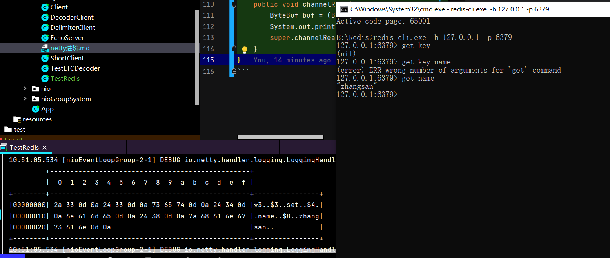

#### 黏包和半包现象

+ TCP/IP的处理都会存在黏包和半包问题
+ 滑动窗口:
    + 传统做法 ==> 发送端只有等到一条消息应答后，才能发送下一条[串行，吞吐量低]
    + 改进 ==> 设置一个窗口[一定大小的缓冲区]，可以多条数据发送，多条数据应答。一次发送的数据量不可以超过窗口大小。
+ 好处:
    1) 窗口起到一个缓冲区的作用，同时也起到一个流量控制的作用[通过缓冲区限制发送和接受的数据大小]
    2) 只有窗口的第一个应答回复，才会向下滑动，这样可以避免发送数据的丢失。比如目前窗口代表第2 3 4 5 条数据的发送，就算3 4 5条数据应答了，由于第2条数据没有应答，窗口依旧等待第二条数据的应答。这涉及到快重传机制
    3) 接收方也维护一个窗口，只有落在窗口内的数据才允许接受[此窗口的大小在报文里的Win字段里进行调整]
+ 和黏包半包的联系: 如果滑动窗口的容量不足以接受一条消息的全部，就会把此消息截断一部分，如果容量充足，会把多条报文堆积在一起。滑动窗口中缓冲了多个报文就会产生黏包
+ Nagle算法 ==> 会造成黏包。
  IP和TCP层分别有20字节的报头。就算只有一个字节的主体，到达TCP层后，数据为41字节。Nagle算法会让尽可能多的数据发送，避免报文导致的传输率低[即延迟等待，尽量把多个及其小的包黏在一起发送出去]
+ 应用层 ==> 接收方的ByteBuf过大[netty默认1024]，造成黏包，ByteBuf的容量小于实际数据量，导致半包
+ MSS限制 ==> 以太网限制数据包大小MTU=1500,因此数据最多只能传输1460字节，这就导致大的数据会被切片为多个段[localhost是本机回环地址，不经过网卡[即不经过数字链路层]，所以没有MSS的限制]

补充

+ 滑动窗口的大小，在TCP报文的win字段里进行协商确定
+ 但是我们可以通过启动器的option()方法手动设置
+ // .option(ChannelOption.SO_SNDBUF) ==> 发送数据的缓冲区 // .option(ChannelOption.SO_RCVBUF, 10) ==> 接受数据的缓冲区
+ 应用层缓冲区[ByteBuf]的默认大小为1024，我们也可以手动调整
+ childOption(ChannelOption.RCVBUF_ALLOCATOR, new AdaptiveRecvByteBufAllocator(16,16,16));

本质:TCP是流式协议，消息无边界

解决方案

1) 短连接
    1) 客户端发送一条数据后，就把连接断开。断开时服务器触发读事件，read方法返回-1，于是就可以判断消息发送完毕。 ==> 成功解决黏包问题
    2) 也就是说:就算可能存在nagle算法等，使得多条信息一同发送，可我们的短连接使得一条消息发完后，第二条就没机会再发了，因此解决黏包问题
    3) 问题:无法解决半包问题
2) netty提供的解码器处理器 FixedLengthFrameDecoder:定长解码器
    1) 工作方式:客户端和服务器端规定一条消息的长度，在服务器端的解码器 按照定长消息进行解码。
    2) 如果客户端的消息长度不够定长，需要用额外字符补充。
    3) 注意事项: 定长长度取决于客户端的最长信息，解码器处理器要在日志处理器之前
    4) 缺点: 不够时要补充占位字符，消耗较大。
3) 行解码器: LineBasedFrameDecoder ==> 使用分隔符界定边界。[\r\n 和 \n 都支持]
    1) 注意：需要指定最大长度，当读到最大长度还没找到分隔符时，抛异常 ==> 防止消息本身格式不正确/恶意攻击的消息
4) 自定义分隔符解码器 DelimiterBasedFrameDecoder
    1) 上面两种的缺点:这两种解码器需要遍历发来的数据，以定位分割符，效率比较差。
5) LengthFieldBasedFrameDecoder ==> LTC Length Type Content
    1) 和服务器规定好一条消息的格式，即一条消息不仅有消息内容，还有消息的长度。 ==> 如果出现了黏包/半包，会调整缓冲区使得一条消息是完整的
    2) 构造器参数:
        1) lengthFieldOffset: 长度字段在完成消息的偏移量 [长度字节之前可能包含魔数等附加信息，要定位到长度字节，需要跳过这些附加信息]
        2) lengthFieldLength: 长度字节本身的长度。 ==> 如果offset=0，length=2. 那么消息的[0,2)就是表示长度的两个字节
        3) lengthAdjustment: 从长度字节开始算，还有几个字节是内容 [还有几个字节，就是附加的字节，这个字段就是要把 这个附加字节给跳过]
        4) initialBytesToStrip: 需要过滤的消息内容，即此字段表示，裁剪消息的前几个字符
    3) 参数1的情况就是考虑到附加信息在长度字段前，而参数3的情况就是考虑附加信息在长度字段和内容之间
    4) 例子: 附加信息A[2B] 长度字节[3B] 附加信息B[1B] 内容[17B] ==>
       lengthFieldOffset=2,lengthFiledLength=3,lengthAdjustment=1.最后一个取决于我们需要的内容是什么

##### 协议的解析与设计

Redis协议: 发送命令 ==> set key value 发送格式 ==>

*3    [命令数组[set,key,value]长度]

\r\n

$3[命令长度]

\r\n

set[命令名称]

\r\n

$4[变量长度]

\r\n

name[变量名]

\r\n

$8[变量名]

\r\n

zhangsan[变量长度]

\r\n

```java
class TestRedis {
    // 模拟Redis命令 set name zhangsan
    public void channelActive(ChannelHandlerContext ctx) throws Exception {
        ByteBuf buf = ctx.alloc().buffer();
        buf.writeBytes("*3".getBytes(StandardCharsets.UTF_8));
        buf.writeBytes(LINE);
        buf.writeBytes("$3".getBytes(StandardCharsets.UTF_8));
        buf.writeBytes(LINE);
        buf.writeBytes("set".getBytes(StandardCharsets.UTF_8));
        buf.writeBytes(LINE);
        buf.writeBytes("$4".getBytes(StandardCharsets.UTF_8));
        buf.writeBytes(LINE);
        buf.writeBytes("name".getBytes(StandardCharsets.UTF_8));
        buf.writeBytes(LINE);
        buf.writeBytes("$8".getBytes(StandardCharsets.UTF_8));
        buf.writeBytes(LINE);
        buf.writeBytes("zhangsan".getBytes(StandardCharsets.UTF_8));
        buf.writeBytes(LINE);
        ctx.writeAndFlush(buf);
        super.channelActive(ctx);
    }

    // 我们发送的数据被Redis服务端成功接收，返回 +OK\r\n
    @Override
    public void channelRead(ChannelHandlerContext ctx, Object msg) throws Exception {
        ByteBuf buf = (ByteBuf) msg;
        System.out.println(((ByteBuf) msg).toString(StandardCharsets.UTF_8));
        super.channelRead(ctx, msg);
    }
}
```



总结
+ 只要客户端遵守协议，就可以与相关的服务器端进行通讯

搭建Http服务器

```java
// 
// 使用netty提供好的 http编解码器 [Codec == Encoder+ Decoder] 类似调制解调器的命名法
// 解码器相当于是 入站的一个handler，而编码器相当于出站handler
ch.pipeline().addLast(new HttpServerCodec());

public final class HttpServerCodec extends CombinedChannelDuplexHandler<HttpRequestDecoder, HttpResponseEncoder>
        implements HttpServerUpgradeHandler.SourceCodec
```

+ netty把http请求内容解析为两部分 ==> 请求行+请求头[io.netty.handler.codec.http.DefaultHttpRequest],请求体[io.netty.handler.codec.http.LastHttpContent$1]
+ 使用netty设计的 职责链模式，可以设置多个handler 进行消息的链式处理
+ 这样我们就不用手动if-else判断消息类型，并处理相关类型的消息。
+ 使用SimpleChannelInboundHandler<T>，可以只对上一个handler传来的T类型的msg感兴趣

+ http服务器的响应对象
+ netty提供了DefaultFullHttpResponse对象。

#### 自定义协议

+ 魔数 ==> 用来在第一时间判定是不是无效数据包
+ 版本号 ==> 可支持协议的升级
+ 序列化算法 ==> 消息正文采取那种序列化反序列化方式 [也就是正文采取哪种格式传输] ==> json，protobuf，hessian，jdk
+ 指令类型 ==> 登陆/注册/单聊/群聊 ... [T]
+ 请求序号 ==> 为双工通讯 提供异步能力 [异步就是不用等待上一个请求的响应回来，就可以发下一个，比如TCP中采取ACK/SEQ来保证异步通讯可靠性]
+ 正文长度 [L]
+ 消息正文 [C]

#### 共享handler

我们定义的帧解码器，在同一个协议中可能被多个channel使用。可不可以抽取出来呢?
